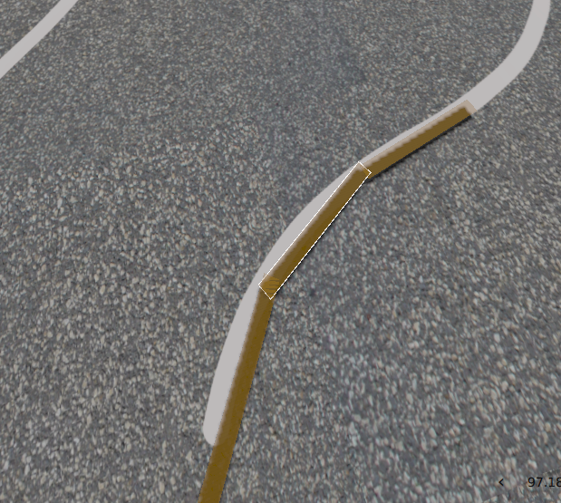

# Create Custom Simulations

> **🚨 IMPORTANT:** I highly recommend that when you create a new simulation, you follow these steps VERY carefully. The directory structure and scripts to launch the simulations are precise and can be tedious. Even if you are proficient with Gazebo, you should still use the template workflow provided here.

Creating a custom simulation for this framework is actually easy—it is done by customizing a copy of the template world. 

### Unit Simulations
Think of these simulations as **unit tests**. They should place the robot in a novel circumstance and test if it can behave correctly. Do your best to keep the simulation small and simple. Browse through the `/worlds` directory and look at the different simulation previews for reference.

### Large Simulations
You have more freedom here. The design philosophy is yours, but you must keep the process.


## 1. Copy the Simulation Template and Launch File
The template consists of a directory for the simulation and a launch script. Copy them both and rename them, replacing `template` with your simulation's name. Be descriptive about the contents of your world! 

The template locations are shown below:
```yaml
ros2_ws
├── README_GUIDES
└── src
    └── littleblue_sim
       ├── launch
       └── worlds
            ├── large_sims
            └── unit_sims
                └── template         # COPY THIS DIR
```

## 2. Refactor the simulation name:
There are two places in the copied template where you need to change the simulation name from template to your new name. This must exactly match the name of your new simulation folder and launch file.
1. The name of the ```.world``` file
2. The name IN the ```.world``` file (line 3)

## 3. Draw The Course Floor Plane:
The textures folder in your new simulation has an image that will be cast onto the floor. Currently it is just blank asphault texture. The easiest and most professional way to design your course is to go to some drawing software (I like [photopea](https://www.photopea.com/)) and draw nice, smooth lines on the image. Once you have your course drawn up, save it back in the same location with the same name.
```yaml
worlds
├── ...
└── unit_sims
    ├── ...
    └── your_new_world
        └── custom_models
            ├── ...
            └── floor
                ├── ...
                └── materials
                    ├── ...
                    └── textures
                        └── floor_picture.png <-- SAVE HERE

```
If you use [photopea](https://www.photopea.com/) you can open up the image then go to:

```View``` --> ```Show``` --> ```Grid```

Then:

```Edit``` --> ```Preferences```

And change/color the grid based on course size. The template image is blank, square asphault, so a NxN grid allows you to create a scale for drawing your course. Most courses ar 10mx10m so I use a 10x10 grid to make sure the robot has enough clearance to actually navigate the course.

The **brush tool** is the best for drawing curved lines by far, just increase the "smoothness" so the lines aren't jagged and ugly. Straight lines can be done easiest with the **shape tool**.


## 4. Change The Size of Your World (optional):
In ```model.sdf```, you can change the dimensions of the ground plane. 
```yaml
worlds
├── ...
└── your_new_world
    └── custom_models
        ├── ...
        └── floor
            ├── ...
            └── model.sdf <--- THIS FILE
```
Line 9 and 16 have the two size attributes. Both lines look like this:
```xml
<size>10 10 0.1</size> <!-- COURSE SIZE HERE IN METERS -->
```
Adjust those to fit your desired world.

### IF YOU CHANGE THE SIZE OF THE WORLD
Then in the ```.world``` file there are a few lines at line 33 that look like this:
```XML
<include> <uri>model://floor</uri> <pose>0 0 0 0 0 0</pose> </include>
...
<include> <uri>...<uri/> <pose>-10 10 0 0 0 0</pose> </include>
<include> <uri>...<uri/> <pose>-10 -10 0 0 0 0</pose> </include>
```

These define the entire ground plane: Your square course and 8 equally large, blank tiles surrounding it. This prevents the robot from thinking it's ever running towards a cliff. Just changes these values based on the size of your world.

## 5. Build and Launch Your Simulation:
This is where it gets fun. Now you need to launch your simulation so you can visually position the obstacles, the robot, and the user camera.
```bash
cd ~/ros2_ws
colcon build --symlink-install
source install/setup.bash
ros2 launch littleblue_sim unit_sim.launch.py world:=yourWorld world_building_mode:=true
```
If you've followed along, a basic simulation with your floor design should render.

## 6. Placing Obstacles
1. With the simulation open, go to the 3 dots in the top right corner. Search for **Resource Spawner**. 

    It should open a window on the left.
2. Under **Local Resources** click one ending in ```.../littleblue_sim/models```

    You should see a few options for objects. Namely ```ramp```, ```cone```,  ```barrel```, and some ```line_obstacles```
3. Click on ```barrel```. You should be able to use your mouse to drag and drop it wherever you want.

    Go ahead and place the barrel somewhere.
4. Select that barrel.

    With it highlighted, press ```ctrl+c```

    Then ```ctrl+v```

    See what happens? You can quickly drop obstacles all over the map. This works with all the objects.

5. Use these techniques to place all your obstacles.

## 7. "Trace" The Lane Lines
Some background:
* This simulation framework detects if you've hit an object with collision sensors and then fails the robot.

* This simulation has absolutely no way to tell if you've crossed a white line because the node that monitors your simulation is blind to where the lines are.

* There is a work-around for this, we can use the same system as the obstacles. 

    In Gazebo when you make an object you can specify it's physical shape separate from its visual. In other words, we can make solid objects that look invisible to the cameras and detect if the robot touches it.

* Now there is a catch: They have to be really small and close to the ground or else the Lidar will detect them.

### "But if they're invisible, how will we see where to place them??"

Great question. You see how there's 2 obstacles named ```line_boundary```? One is invisible and the other is not! They also have the exact same length and width! So here's how we're going to set up our course for lane-line-reporting:

1. In the **Resource Spawner** click on ```line_boundary```

    Make sure it's the visible one. If you can't see anything when you drag your mouse into the gui, then you have the wrong one.

2. Place it near one of the lanes

3. Using the **Translation** and **Rotation** tools, get it close and parallel

4. Copy that little twig, paste it and line your lanes!

    You should end up with something that looks like this:
    

### Save the File
Once you've done the tedious work of placing all your objects, now you save the file as a "snapshot" of the simulation state.

1. In Gazebo, click on the menu icon in the upper, left corner

2. Click **Save world as...**

3. Save the world as:
    ```~/your-path/ros2_ws/src/littleblue_sim/worlds/unit_sims/yourWorld/temp.sdf```

4. You should see the file in your world's folder

## 8. Make It Permanant
1. If you open ```temp.sdf``` you should see a hideous wall of generated sdf code. Not very far down you should see your first ```<include>``` tag for the floor. Skip that.
2. Copy all the rest of the objects after it.

    Every single object sandwiched in ```<include> ... <include/>```

3. Paste it in the ```.world``` file.

    At the very end of the file. Right before the ```</world>``` closing tag.

4. Refactor the <uri> tags

    It should show that each object has a large uri tag. Something like:
    ```file:///home/andrew/IGVC/ros2_ws/install/littleblue_sim/share/littleblue_sim/models/barrel```

    Good thing modern IDEs make it really easy to refactor names...


    Highlight the entire path, *except* the object:
    ```file:///home/andrew/IGVC/ros2_ws/install/littleblue_sim/share/littleblue_sim/models/```barrel

    Refactor it to ```model://```barrel

    Now all those ugly, hard-coded paths are gone!

5. Refactor the line_boundaries:

    You should have a pretty hefty number of objects with a uri of:
    ```model://line_boundary_visible```

    Refactor it to:
    ```model://line_boundary```


## 9. Position The Robot and GUI

## 10. Place the Finish Line


## 11. Take a Screenshot

You (and others in the future) might want a sneak peek of your simulation without having to launch the whole thing. Take a screenshot of your course, crop it, and save it here:
```/worlds/unit_sims/your_new_world/thumbnail.png```

## 12. Add It To The Master Script

✅ You're done! That is all it takes! Tedious, sure, but easy!